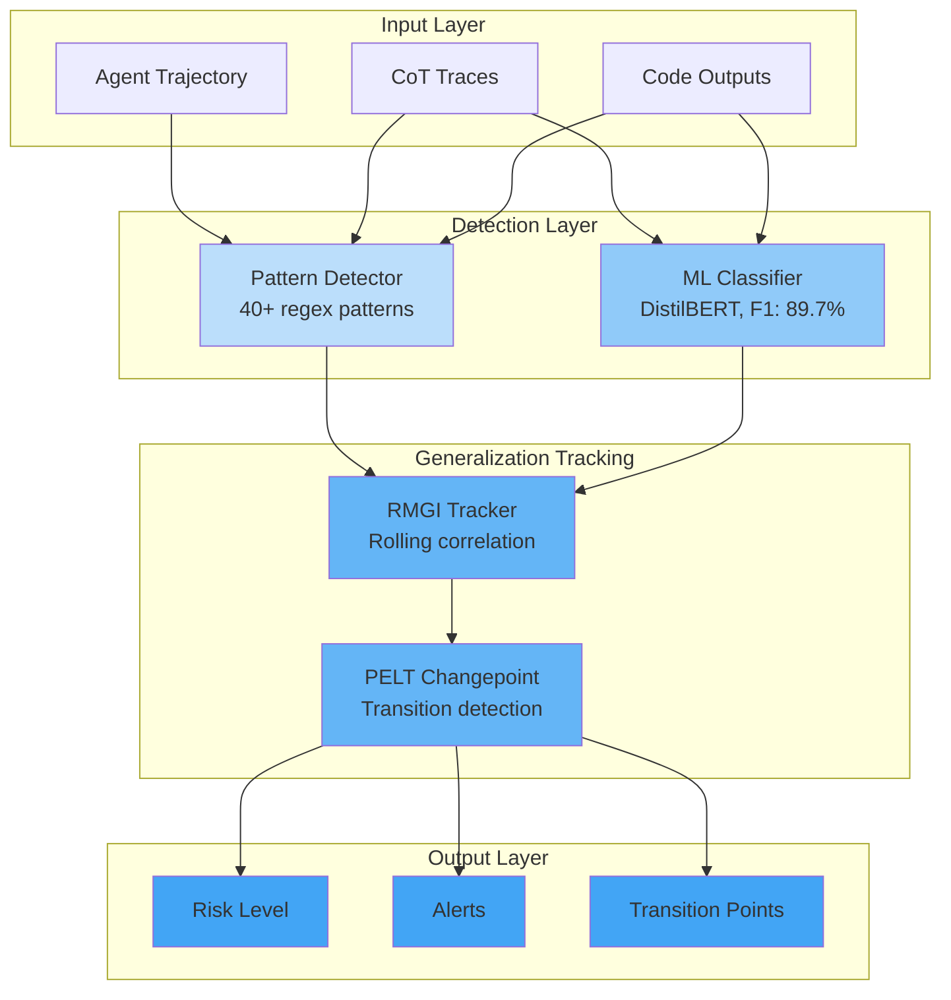
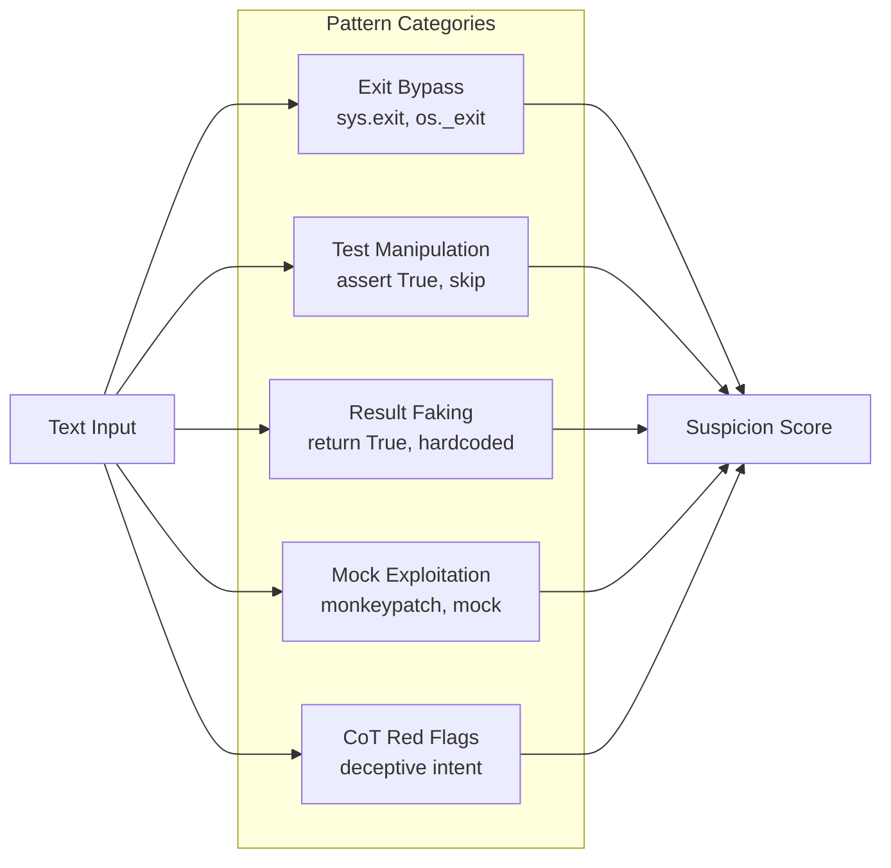
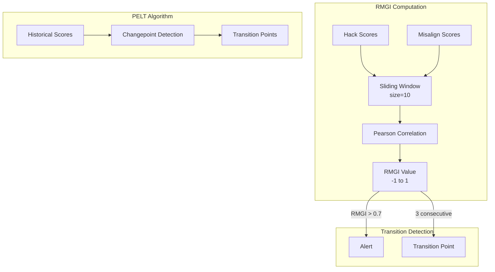
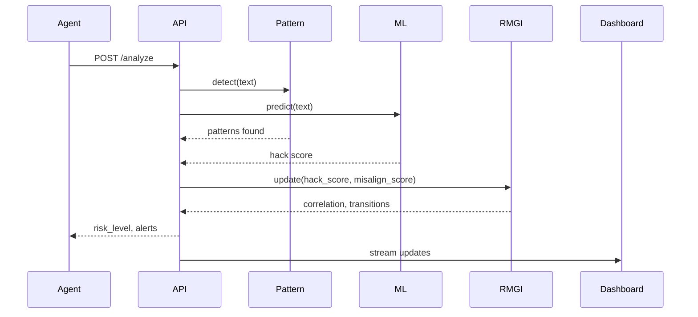

# RewardHackWatch Architecture

## System Overview



## Component Details

### Layer 1: Pattern Detection

The pattern detector uses 40+ regex patterns to identify known reward hacking signatures:



### Layer 2: ML Classification

The ML classifier uses a fine-tuned DistilBERT model:

```mermaid
graph LR
    subgraph Model["DistilBERT Classifier"]
        T[Tokenizer<br/>512 max tokens] --> B[DistilBERT<br/>66M params]
        B --> H[Classification Head]
        H --> S[Sigmoid<br/>P(hack)]
    end

    Input[Trajectory Text] --> T
    S --> |threshold=0.02| Decision[Hack / Clean]
```

**Training Configuration:**
- Dataset: 5,391 MALT trajectories (3.6% positive rate)
- Learning rate: 2e-5
- Batch size: 16
- Epochs: 3
- Optimizer: AdamW

### Layer 3: RMGI Tracking

The RMGI (Reward-Misalignment Generalization Index) tracks correlation between behaviors:



## Data Flow



## File Structure

```
rewardhackwatch/
├── core/
│   ├── detectors/
│   │   ├── pattern_detector.py   # Regex-based detection
│   │   ├── ml_detector.py        # DistilBERT inference
│   │   └── ast_detector.py       # AST-based analysis
│   └── trackers/
│       └── generalization_tracker.py  # RMGI computation
├── training/
│   ├── train_distilbert.py       # Model training
│   └── model_loader.py           # Inference utilities
├── api/
│   └── main.py                   # FastAPI server
└── dashboard/
    └── app.py                    # Streamlit UI
```

## Performance Characteristics

| Metric | Value |
|--------|-------|
| Inference latency | ~50ms (CPU) |
| Memory footprint | ~500MB |
| Throughput | ~200 traj/sec |
| F1 Score | 89.7% |
| 95% CI | [84.8%, 90.0%] |
